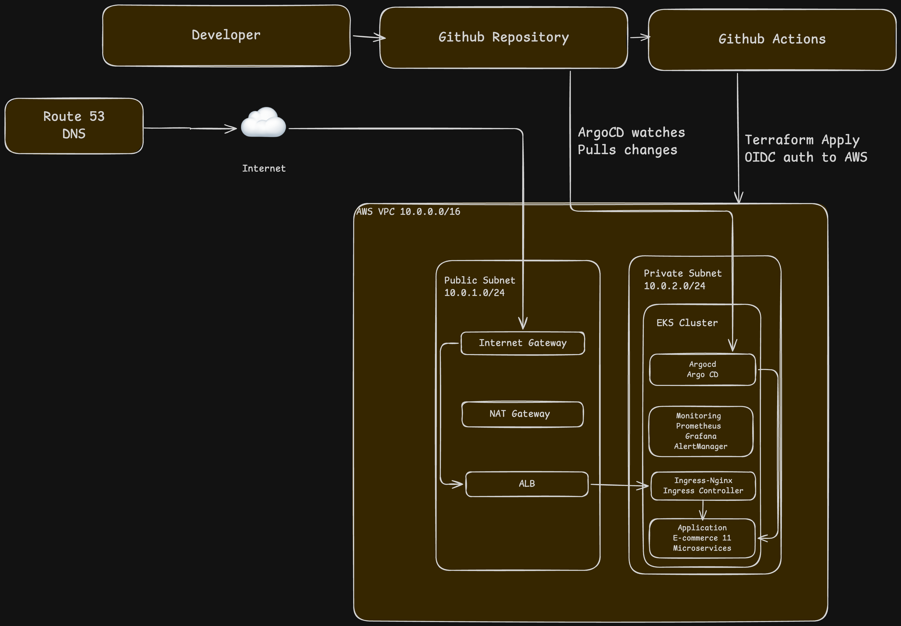

# EKS GitOps Platform

A production-grade Kubernetes platform on AWS EKS implementing 
GitOps principles for automated, secure, and observable deployments.

## Live URLs
- Application: https://app.bwaife.org
- Argo CD: https://argocd.bwaife.org
- Grafana: https://grafana.bwaife.org

## Architecture


## Stack
| Component | Tool | Purpose |
|---|---|---|
| Infrastructure | Terraform | IaC with remote state |
| Cluster | AWS EKS | Managed Kubernetes |
| GitOps | Argo CD | Automated deployments |
| Ingress | Ingress-NGINX | Traffic routing |
| TLS | cert-manager | Automated certificates |
| DNS | ExternalDNS | Route 53 automation |
| Secrets | External Secrets | AWS Secrets Manager |
| Monitoring | Prometheus + Grafana | Observability |
| Alerting | AlertManager | Alert routing |
| Security | Checkov + Trivy | Scanning |
| CI/CD | GitHub Actions | Automated pipeline |
| Auth | OIDC + IRSA | Keyless AWS auth |

## Key Features
- Full GitOps loop — Git is the single source of truth
- IRSA enforces least privilege per component
- Automated TLS via Let's Encrypt DNS-01 validation
- Cross namespace Prometheus scraping
- Manual approval gate before terraform apply
- Zero static credentials anywhere in the system

## Pipeline Flow
```
Push to main
      ↓
Security scan — Checkov + Trivy
      ↓
Terraform plan + manual approval
      ↓
Terraform apply via OIDC
      ↓
Argo CD detects changes
      ↓
Automatic cluster reconciliation
```


## Project Structure
```
├── infra/
│   ├── bootstrap/     # Remote state setup
│   ├── modules/
│   │   ├── vpc/       # Networking
│   │   ├── eks/       # Cluster
│   │   └── irsa/      # IAM roles
│   └── main.tf
├── k8s/
│   ├── argocd/        # Argo CD config
│   ├── monitoring/    # Prometheus values
│   └── apps/          # Application manifests
└── .github/
    └── workflows/     # CI/CD pipeline
```

## How To Deploy
### Prerequisites
- AWS CLI configured
- Terraform installed
- kubectl installed
- Helm installed

### Bootstrap Remote State
\`\`\`bash
cd infra/bootstrap
terraform init
terraform apply
\`\`\`

### Deploy Infrastructure
\`\`\`bash
cd infra
terraform init
terraform apply
\`\`\`

### Install Core Components
\`\`\`bash
helm install ingress-nginx ingress-nginx/ingress-nginx \
  --namespace ingress-nginx --create-namespace
helm install cert-manager cert-manager/cert-manager \
  --namespace cert-manager --create-namespace \
  --set crds.enabled=true
\`\`\`

### Connect Argo CD
\`\`\`bash
kubectl apply -f k8s/argocd/application.yaml
\`\`\`

## Security Decisions
- IRSA replaces node instance profiles — each pod assumes only its required role
- OIDC eliminates static credentials in GitHub Actions
- Checkov enforces Terraform security standards in every PR
- Trivy blocks HIGH and CRITICAL container vulnerabilities
- cert-manager uses DNS-01 validation — no public endpoint required

## Known Limitations
- EKS public endpoint accessible from 0.0.0.0/0 — acceptable for portfolio
- No KMS encryption on EKS secrets — would add in production
- Single NAT Gateway — would use one per AZ in production for HA